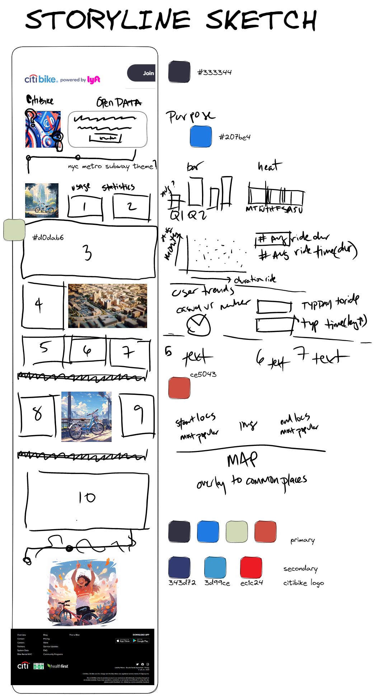
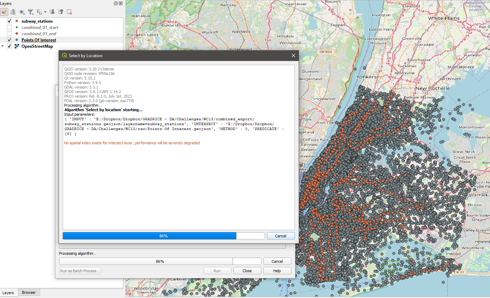

# citibikedashboard
 Dashboard for NYC officials

## direct link

[Citibike Dashboard](https://public.tableau.com/app/profile/kuromasa.dev/viz/CitiBike2023Dashboard/Dashboard1)

## getting started 

The team has yet to implement a dashboard or sophisticated reporting process. 

City officials have questions about the program, so the first task on the job is to build a set of data reports to provide the answers. 

## visualization outline 

1. **Usage Statistics:**
   
    - What is the total number of rides taken?
    - What is the average duration of each ride?
    - What are the peak usage times (hours, days)?
    - How many unique users are there in each quarter?
    - What is the average number of rides per user?
1. **Geographical Trends:**
   
    - Which locations are the most popular starting and ending points for rides?
    - What are the most common routes taken?
    - What are common Points of Interest (POI)? 
    - What are common major rail transit stations? 

## layout sketches

## aggregating and post-processing data

step 1: downloaded monthly data for the first and second quarter of 2023 from the citibike [site](https://citibikenyc.com/system-data)

step 2: download open data from the city of new york/new jersey open data 

- Points of interest [site](https://data.cityofnewyork.us/City-Government/Points-Of-Interest/rxuy-2muj)
- Subway stations [site](https://data.cityofnewyork.us/Transportation/Subway-Stations/arq3-7z49)
- light rail stations from New Jersey [site](https://njogis-newjersey.opendata.arcgis.com/search?groupIds=60a4f9a1342f4f7a94ac986e8dd14892)

GIS data was downloaded as .geojson and brought into qGIS to process against the CitiBike data. 

step 3: geoprocessing in qGIS

> during geoprocessing, filtered out data from Citibike that did not have an "end time" or a geolocation

*Step 2 data was buffered and filtered around a quarter mile distance from the end points.* 

step 4: create relate tables  

- Citibike points > subway stations > points of interest 

step 5: process geojsons through panda dataframes to generate .csv for Tableau public

## composing the story

Strategy: formulate dashboard around a presentation to city officials, but also make it to where it can be publicly shared to constituents and other agencies interested in the analysis. 

unite graphics through color scheme and vivid images that highlight the energy and playfulness around bike riding and active transportation. 
